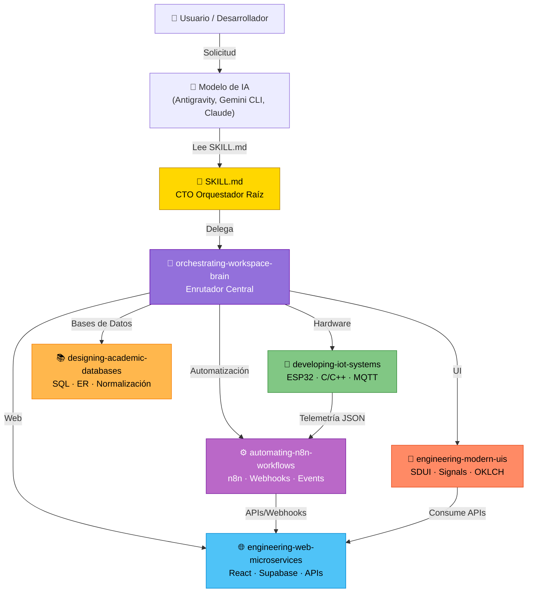
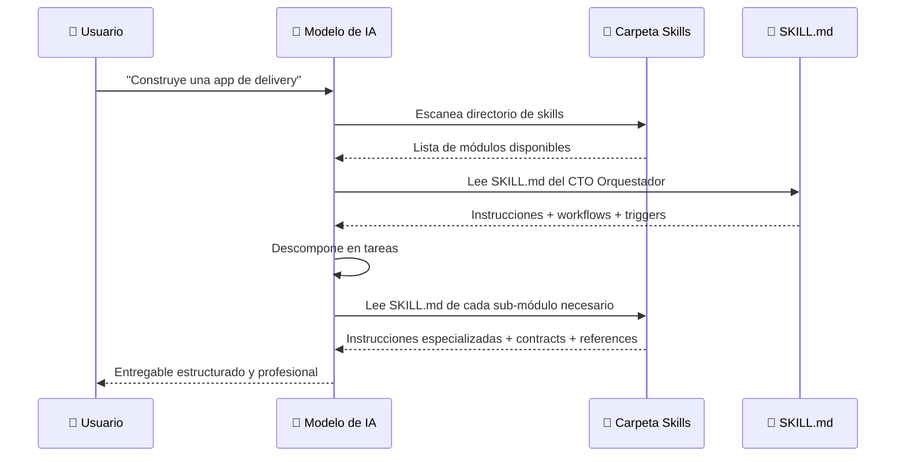

# Antigravity Skill Ecosystem 🌌

[](LICENSE)
[](#-instalación-multiplataforma)
[](#-modelos-de-ia-compatibles)

Un ecosistema modular de Skills (habilidades) diseñado para potenciar agentes de Inteligencia Artificial. Cada skill es un módulo de instrucciones especializadas que transforma a un modelo de IA en un experto de dominio — desde arquitectura web hasta firmware embebido.

---

## 📐 Estructura del Proyecto

```
Skills.md/
│
├── 📄 README.md                          ← Estás aquí
├── 📄 SKILL.md                           ← 👑 CTO Orquestador (skill raíz)
├── 📄 ADVANCED.md                        ← Guía avanzada de orquestación
│
├── 🧠 orchestrating-workspace-brain/     ← Enrutador central (Cerebro)
│   ├── SKILL.md
│   └── REGISTRO_MAESTRO.md              ← Inventario de proyectos activos
│
├── 🌐 engineering-web-microservices/     ← Full-Stack Web + Supabase
│   ├── SKILL.md
│   ├── contracts/
│   │   └── acuerdos-conexion.md
│   └── references/
│       ├── arquitectura-backend.md
│       ├── reglas-oro-web.md
│       ├── supabase-patterns.md
│       └── vanilla-standards.md
│
├── 🎨 engineering-modern-uis/            ← UI de alto rendimiento 2026
│   ├── SKILL.md
│   ├── examples/
│   │   ├── component-template.html
│   │   └── signals-state.js
│   ├── references/
│   │   └── paradigmas-frontend.md
│   ├── resources/
│   │   └── design-tokens.json
│   └── scripts/
│       └── audit-performance.sh
│
├── 🔌 developing-iot-systems/            ← Firmware ESP32/Arduino (C/C++)
│   ├── SKILL.md
│   ├── contracts/
│   │   └── esquema-telemetria.md
│   └── references/
│       ├── firmware-industrial.md
│       ├── hardware-mapping.md
│       └── mejores-practicas-cpp.md
│
├── ⚙️ automating-n8n-workflows/          ← Automatización con n8n
│   ├── SKILL.md
│   ├── contracts/
│   │   └── webhook-maestro.md
│   └── references/
│       ├── flujos-idempotentes.md
│       └── patrones-event-driven.md
│
├── 📚 designing-academic-databases/      ← Formación profesional DB (Estudiantes)
│   ├── SKILL.md
│   └── references/
│       ├── estandares-db-academicos.md
│       ├── guia-seguridad-estudiantil.md
│       └── patrones-diseno-relacional.md
│
├── 📂 examples/                          ← Ejemplos de orquestación
│   ├── startup-orchestration.md
│   └── software-orchestration.md
│
└── 📂 resources/                         ← Templates de workflow
    └── workflow-templates/
        ├── startup.md
        ├── software.md
        ├── research.md
        └── automation.md
```

---

## 🏗️ Diagrama de Arquitectura



---

## 🤖 Modelos de IA Compatibles

Estas skills están diseñadas para funcionar con modelos de IA que soporten la lectura de archivos locales y la ejecución de instrucciones estructuradas.

| Modelo / Agente | Compatibilidad | Método de Uso | Notas |
|-----------------|:--------------:|---------------|-------|
| **Google Antigravity** | ✅ Completa | Lee skills automáticamente desde `/mnt/skills/` o directorio local | Diseñado nativamente para este formato |
| **Google Gemini CLI** | ✅ Completa | Configurar como skills en `~/.gemini/` | Soporta YAML frontmatter + Markdown |
| **Anthropic Claude** (via API/MCP) | ✅ Completa | Cargar como contexto del sistema o via MCP file server | Lee Markdown estructurado nativamente |
| **OpenAI GPT-4 / o1** | ⚠️ Parcial | Copiar contenido de SKILL.md como System Prompt o usar API Assistants con File Search | No tiene acceso nativo a archivos locales |
| **Cursor AI** | ✅ Completa | Colocar en `.cursor/rules/` o como documentos del proyecto | Lee reglas Markdown del proyecto |
| **GitHub Copilot** (Workspace) | ⚠️ Parcial | Incluir como archivos del repositorio, referenciar via `@workspace` | Contexto limitado por ventana |
| **Windsurf / Codeium** | ✅ Completa | Colocar en directorio raíz del proyecto como reglas | Soporta instrucciones Markdown |
| **Obsidian + AI Plugins** | ✅ Completa | Abrir como Vault de Obsidian, usar plugins AI compatibles | Wikilinks `[[]]` funcionan nativamente |

### ¿Cómo funciona?



**En resumen:** El modelo de IA lee los archivos `SKILL.md` como si fueran **manuales de instrucciones especializadas**. Cada skill le dice al modelo:
1. **Qué sabe hacer** (description, triggers)
2. **Cómo debe hacerlo** (workflow: Plan → Validate → Execute)
3. **Qué estándares seguir** (contracts, references)
4. **Cómo comunicarse** con otros módulos (topología del ecosistema)

---

## 🚀 Instalación Multiplataforma

### Prerrequisitos

- [Git](https://git-scm.com/downloads) instalado en tu sistema
- Un modelo de IA compatible (ver tabla de compatibilidad arriba)

### Paso 1: Clonar el Repositorio

Abre tu terminal y ejecuta:

```bash
git clone https://github.com/cristopher281/Skills.md.git
```

### Paso 2: Ubicar las Skills según tu Agente de IA

A continuación se describen las rutas de instalación para cada agente y sistema operativo.

---

#### 🟢 Google Antigravity / Gemini CLI

<details>
<summary><strong>🪟 Windows</strong></summary>

```powershell
# Clonar en la carpeta de skills de Gemini
git clone https://github.com/cristopher281/Skills.md.git "%USERPROFILE%\.gemini\skills"

# O copiar si ya clonaste en otro lugar
xcopy /E /I "Skills.md" "%USERPROFILE%\.gemini\skills"
```
</details>

<details>
<summary><strong>🍎 macOS</strong></summary>

```bash
# Clonar en la carpeta de skills de Gemini
git clone https://github.com/cristopher281/Skills.md.git ~/.gemini/skills

# O copiar si ya clonaste
cp -r Skills.md/ ~/.gemini/skills/
```
</details>

<details>
<summary><strong>🐧 Linux</strong></summary>

```bash
# Clonar en la carpeta de skills de Gemini
git clone https://github.com/cristopher281/Skills.md.git ~/.gemini/skills

# O copiar si ya clonaste
cp -r Skills.md/ ~/.gemini/skills/
```
</details>

---

#### 🟣 Anthropic Claude (via MCP)

Para usar con Claude Desktop o Claude API via Model Context Protocol:

<details>
<summary><strong>🪟 Windows</strong></summary>

```powershell
# 1. Clonar el repositorio
git clone https://github.com/cristopher281/Skills.md.git "%USERPROFILE%\Skills"

# 2. Agregar al archivo de configuración MCP de Claude Desktop
# Editar: %APPDATA%\Claude\claude_desktop_config.json
```

Agregar al JSON de configuración:
```json
{
  "mcpServers": {
    "skills-filesystem": {
      "command": "npx",
      "args": [
        "-y",
        "@anthropic/mcp-filesystem",
        "C:\\Users\\TU_USUARIO\\Skills"
      ]
    }
  }
}
```
</details>

<details>
<summary><strong>🍎 macOS / 🐧 Linux</strong></summary>

```bash
# 1. Clonar el repositorio
git clone https://github.com/cristopher281/Skills.md.git ~/Skills

# 2. Editar config de Claude Desktop
# macOS: ~/Library/Application Support/Claude/claude_desktop_config.json
# Linux: ~/.config/Claude/claude_desktop_config.json
```

Agregar al JSON de configuración:
```json
{
  "mcpServers": {
    "skills-filesystem": {
      "command": "npx",
      "args": [
        "-y",
        "@anthropic/mcp-filesystem",
        "/home/TU_USUARIO/Skills"
      ]
    }
  }
}
```
</details>

---

#### 🔵 Cursor AI

<details>
<summary><strong>Todas las plataformas (Windows / macOS / Linux)</strong></summary>

```bash
# 1. Abrir tu proyecto en Cursor
# 2. Clonar este repo dentro de tu proyecto o en la carpeta de reglas

git clone https://github.com/cristopher281/Skills.md.git .cursor/skills

# 3. Cursor leerá automáticamente los archivos .md como contexto del proyecto
```

Alternativamente, puedes copiar solo los `SKILL.md` que necesites a `.cursor/rules/`:
```bash
# Copiar un skill específico
cp Skills.md/engineering-web-microservices/SKILL.md .cursor/rules/web-microservices.md
```
</details>

---

#### 🟡 OpenAI GPT-4 / ChatGPT

<details>
<summary><strong>Todas las plataformas</strong></summary>

GPT-4 no tiene acceso directo a archivos locales. Opciones de uso:

**Opción A — System Prompt:**
1. Abre el archivo `SKILL.md` del módulo que necesites
2. Copia su contenido completo
3. Pégalo como System Prompt (instrucciones del sistema) en la API de OpenAI
4. El modelo actuará como ese especialista

**Opción B — GPTs Personalizados (ChatGPT Plus):**
1. Crea un GPT personalizado en [chat.openai.com](https://chat.openai.com)
2. Sube los archivos `.md` como archivos de conocimiento
3. En las instrucciones indica: *"Sigue el workflow Plan → Validate → Execute descrito en los archivos adjuntos"*

**Opción C — API Assistants con File Search:**
```python
from openai import OpenAI
client = OpenAI()

# Subir archivos de skills
file = client.files.create(
    file=open("SKILL.md", "rb"),
    purpose="assistants"
)

# Crear asistente con las skills como conocimiento
assistant = client.beta.assistants.create(
    name="CTO Orquestador",
    instructions="Sigue el workflow definido en los archivos adjuntos.",
    model="gpt-4o",
    tools=[{"type": "file_search"}]
)
```
</details>

---

#### 📓 Obsidian (como Vault de Conocimiento)

<details>
<summary><strong>Todas las plataformas</strong></summary>

```bash
# 1. Clonar el repositorio
git clone https://github.com/cristopher281/Skills.md.git

# 2. Abrir Obsidian → "Abrir carpeta como vault" → seleccionar Skills.md/

# Los wikilinks [[]] funcionarán automáticamente
# Puedes navegar visualmente el grafo de conocimiento
```
</details>

---

### Paso 3: Verificar la Instalación

Independientemente del método, verifica que tu IA puede leer las skills:

```
Prompt de prueba:
"Lee el archivo SKILL.md en la raíz del directorio de skills
 y dime cuántos módulos especializados tienes disponibles"

Respuesta esperada:
El modelo debería identificar 5 módulos:
 1. engineering-web-microservices
 2. engineering-modern-uis
 3. developing-iot-systems
 4. automating-n8n-workflows
 5. designing-academic-databases
```

---

## 🧩 Los 5 Módulos Especializados

### 👑 CTO Orquestador (Raíz)
- `SKILL.md` — Analiza solicitudes complejas, descompone en grafos de tareas, coordina sub-módulos.
- `ADVANCED.md` — Encadenamiento de workflows, ejecución paralela, protocolo de pase de contexto.

### 🧠 Cerebro — `orchestrating-workspace-brain`
Enrutador central. Recibe solicitudes, analiza intención, y delega al módulo correcto sin ejecutar código directamente.

### 🌐 Web Full-Stack — `engineering-web-microservices`
Desarrolla frontend React, microservicios backend stateless, e integraciones con Supabase (Auth, Edge Functions, Realtime DB).

### 🎨 UI Alto Rendimiento — `engineering-modern-uis`
Interfaces web de 2026: Server-Driven UI, Signals (sin VDOM), CSS Container Queries, colores `oklch()`, Web Animations API y WebGL. Métricas: LCP < 1.0s, INP < 40ms, JS < 40KB.

### 🔌 IoT & Firmware — `developing-iot-systems`
Firmware en C/C++ para ESP32/Arduino. Código no-bloqueante, eficiente en memoria, con telemetría MQTT/HTTP y auto-reconexión.

### ⚙️ Automatización — `automating-n8n-workflows`
Arquitecturas event-driven con n8n. Webhooks, idempotencia, manejo de rate-limits. Entrega blueprints JSON listos para importar.

### 📚 Formación en BD — `designing-academic-databases`
Módulo profesional-educativo. Enseña normalización (1NF–BCNF), diagramas ER, DDL estándar y defensa técnica. Incluye zona segura para estudiantes con checklist de protección y patrones de diseño relacional.

---

## 🔗 Estándares Internos

Cada módulo mantiene la coherencia del ecosistema mediante:
- **`contracts/`** — Reglas de comunicación entre módulos (esquemas JSON, formatos de payload, nomenclaturas compartidas)
- **`references/`** — Mejores prácticas específicas del dominio para evitar errores de principiante

---

## 💡 Cómo Iniciar Operaciones

1. Ordena a tu IA: *"Quiero que el CTO orqueste un nuevo proyecto llamado [Tu Idea]"*
2. El sistema registrará tu proyecto en el **Registro Maestro** del Cerebro
3. El plan será descompuesto y delegado a los módulos especialistas
4. Disfruta un avance sistemático, trazable y profesional

---

## 🤝 Contribuir

Si quieres agregar un nuevo módulo de skill:

1. Crea una carpeta con nombre en formato `verbo-sustantivo` (ej: `analyzing-data-pipelines`)
2. Agrega un `SKILL.md` con frontmatter YAML (`name`, `description`, `triggers`, `version`)
3. Sigue el flujo **Plan → Validate → Execute**
4. Agrega `contracts/` y `references/` según necesidad
5. Registra el módulo en el Cerebro (`orchestrating-workspace-brain/SKILL.md`)

---

## 📄 Licencia

Este proyecto está bajo la licencia MIT. Puedes usar, modificar y distribuir libremente las skills.
