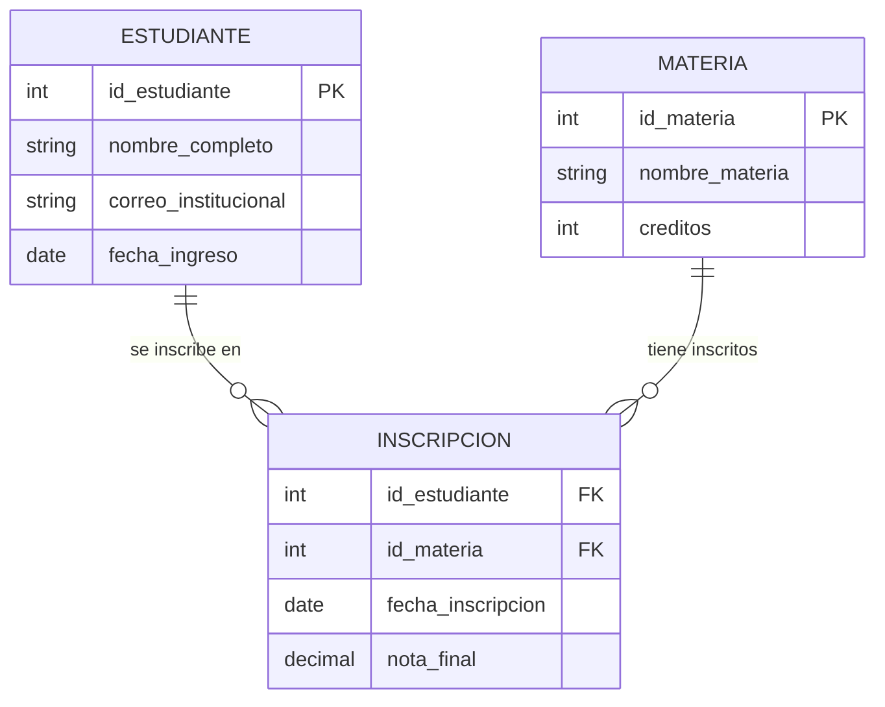

# Estándares de Normalización Profesional

Guía de referencia rápida para las formas normales. Todo esquema generado por este módulo debe cumplir al menos hasta 3NF, documentando cada transformación.

---

## Formas Normales

### Primera Forma Normal (1NF)
- **Regla:** Todo atributo debe ser atómico (indivisible). No se permiten listas, conjuntos ni tablas anidadas dentro de una celda.
- **Error típico:** Almacenar `"Lunes, Martes, Viernes"` en una sola columna de horarios.
- **Solución:** Crear una tabla separada `HORARIOS` con una fila por cada día.

### Segunda Forma Normal (2NF)
- **Prerrequisito:** Cumplir 1NF.
- **Regla:** Todo atributo no clave debe depender completamente de **toda** la Clave Primaria, no solo de una parte.
- **Error típico:** En una tabla con PK compuesta `(id_estudiante, id_materia)`, tener `nombre_estudiante` que solo depende de `id_estudiante`.
- **Solución:** Extraer `nombre_estudiante` a una tabla separada `ESTUDIANTES`.

### Tercera Forma Normal (3NF)
- **Prerrequisito:** Cumplir 2NF.
- **Regla:** Ningún atributo no clave puede depender transitivamente de otro atributo no clave.
- **Error típico:** En `EMPLEADOS`, tener `id_departamento` y `nombre_departamento` — el nombre depende del ID del departamento, no del empleado.
- **Solución:** Extraer a tabla `DEPARTAMENTOS` y dejar solo `id_departamento` como FK.

### Forma Normal de Boyce-Codd (BCNF)
- **Prerrequisito:** Cumplir 3NF.
- **Regla:** Toda dependencia funcional debe tener como determinante una superclave. Resuelve casos especiales que 3NF no cubre con claves candidatas múltiples.
- **Cuándo aplicar:** Solo cuando el docente lo solicite explícitamente o cuando existan múltiples claves candidatas que generen dependencias parciales.

---

## Estándar de Diagramas ER (Mermaid.js)

La comunicación visual entre estudiante e IA se realiza en `Mermaid.js`. Convenciones obligatorias:

### Nomenclatura
| Elemento | Convención | Ejemplo |
|----------|------------|---------|
| Tablas | `UPPER_SNAKE_CASE` | `ESTUDIANTE`, `MATERIA` |
| Columnas | `lower_snake_case` | `id_estudiante`, `nombre_completo` |
| PK | Marcada con `PK` | `int id_estudiante PK` |
| FK | Marcada con `FK` | `int id_materia FK` |

### Cardinalidades
| Símbolo Mermaid | Significado |
|-----------------|-------------|
| `\|\|--o{` | Uno a muchos (1:N) |
| `\|\|--\|\|` | Uno a uno (1:1) |
| `}o--o{` | Muchos a muchos (M:N) — requiere tabla intermedia |

### Ejemplo Estándar


---

## Estándar DDL (Scripts SQL)

### Reglas de Escritura
1. Usar `ANSI SQL` como base. Agregar extensiones de motor (PostgreSQL, MySQL) en comentarios separados.
2. Cada `CREATE TABLE` debe incluir:
   - `PRIMARY KEY` definida explícitamente
   - `FOREIGN KEY` con acción `ON DELETE` y `ON UPDATE` documentada
   - `NOT NULL` en todo campo obligatorio
   - Comentario explicativo en cada columna
3. Incluir `CREATE INDEX` para columnas frecuentemente consultadas (FKs, campos de búsqueda).

### Plantilla DDL
```sql
-- ============================================
-- Tabla: ESTUDIANTE
-- Propósito: Almacena la información básica de cada estudiante matriculado
-- Autor: [Nombre del Estudiante]
-- Fecha: [YYYY-MM-DD]
-- ============================================
CREATE TABLE ESTUDIANTE (
    id_estudiante   INT          NOT NULL,  -- Identificador único del estudiante
    nombre_completo VARCHAR(120) NOT NULL,  -- Nombre legal completo
    correo          VARCHAR(80)  NOT NULL,  -- Correo institucional (@universidad.edu)
    fecha_ingreso   DATE         NOT NULL,  -- Fecha de primera matrícula
    CONSTRAINT pk_estudiante PRIMARY KEY (id_estudiante),
    CONSTRAINT uq_correo UNIQUE (correo)
);

-- Índice para búsquedas por nombre
CREATE INDEX idx_estudiante_nombre ON ESTUDIANTE (nombre_completo);
```
