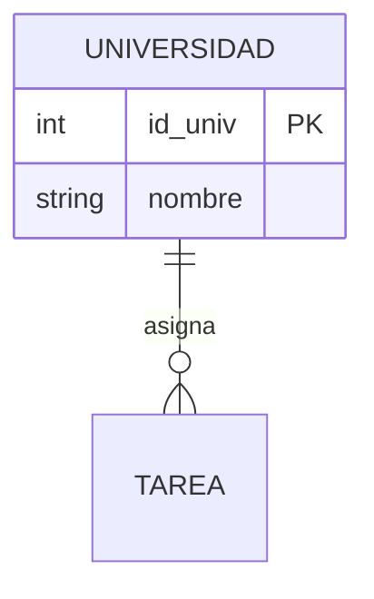

# Patrones Académicos Exigibles (Normalización)

Cualquier proyecto que toque el módulo académico debe guiarse por la integridad perfecta teórica.

1. **Primera Forma Normal (1NF):** Todo atributo debe ser atómico (indivisible). Evitar listas separadas por comas dentro de la misma celda de SQL.
2. **Segunda Forma Normal (2NF):** Se asume la 1NF. Todo atributo no clave debe depender por completo de la totalidad de la Clave Primaria (PK), no solo de una parte de ella (Importante en llaves compuestas).
3. **Tercera Forma Normal (3NF):** Se asume la 2NF. Los atributos no clave no pueden depender de otros atributos no clave (Evitar dependencias transitivas).

## Estándar Diagrama Relacional (Sintaxis Oficial)
La IA y el estudiante se comunican profesionalmente usando `Mermaid.js` para los diagramas.

