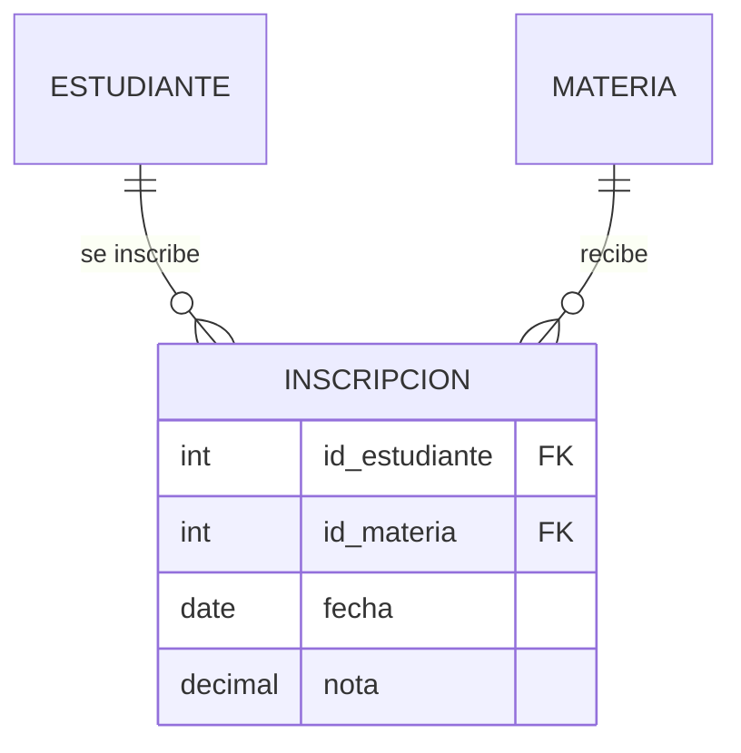

# 📖 Patrones de Diseño Relacional

Patrones probados en la industria para resolver problemas comunes de modelado de bases de datos.

---

## Patrón 1: Descomposición de Relación M:N

**Problema:** Dos entidades tienen relación muchos-a-muchos.
**Solución:** Crear tabla intermedia (asociativa) con PKs de ambas como FK compuesta.



---

## Patrón 2: Herencia de Tablas (Supertipo/Subtipo)

**Problema:** Varias entidades comparten atributos pero tienen especializaciones.
**Solución:** Tabla padre con atributos comunes + tablas hijas con atributos específicos.

```sql
-- Supertipo
CREATE TABLE PERSONA (
    id_persona INT PRIMARY KEY,
    nombre     VARCHAR(100) NOT NULL,
    tipo       VARCHAR(20)  NOT NULL CHECK (tipo IN ('docente', 'estudiante'))
);

-- Subtipos
CREATE TABLE DOCENTE (
    id_persona    INT PRIMARY KEY REFERENCES PERSONA(id_persona),
    especialidad  VARCHAR(80),
    fecha_contrato DATE
);

CREATE TABLE ESTUDIANTE_DETALLE (
    id_persona   INT PRIMARY KEY REFERENCES PERSONA(id_persona),
    carnet       VARCHAR(20) UNIQUE,
    semestre_actual INT
);
```

---

## Patrón 3: Tabla de Auditoría

**Problema:** Necesidad de rastrear quién modificó qué y cuándo.
**Solución:** Columnas de auditoría estándar en cada tabla.

```sql
-- Columnas de auditoría (agregar a toda tabla importante)
creado_por    VARCHAR(50)  NOT NULL DEFAULT CURRENT_USER,
creado_en     TIMESTAMP    NOT NULL DEFAULT CURRENT_TIMESTAMP,
modificado_por VARCHAR(50),
modificado_en  TIMESTAMP
```

---

## Patrón 4: Soft Delete (Borrado Lógico)

**Problema:** Necesidad de "eliminar" registros sin perder historial.
**Solución:** Columna booleana `activo` en vez de `DELETE`.

```sql
ALTER TABLE ESTUDIANTE ADD COLUMN activo BOOLEAN NOT NULL DEFAULT TRUE;

-- "Eliminar" (en realidad desactivar)
UPDATE ESTUDIANTE SET activo = FALSE WHERE id_estudiante = 42;

-- Consultar solo activos
SELECT * FROM ESTUDIANTE WHERE activo = TRUE;
```
